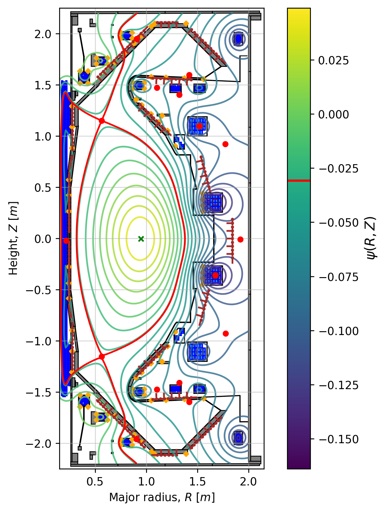

    

# FreeGSNKE: Free-boundary Grad-Shafranov Newton-Krylov Evolve

FreeGSNKE (pronounced "free-gee-snake") is a **Python**-based code for **simulating the evolution of free-boundary tokamak plasma equilibria**.

Based on the well-established [FreeGS](https://github.com/bendudson/freegs) code, it utilises [FreeGS4E](https://github.com/freegs4e/freegs4e) (a fork of FreeGS) to solve different types of free-boundary Grad-Shafranov equilibrium problem and contains a number of new capabilities over FreeGS. 

> **_NOTE:_**  We recommended reading this page in its entirety before attempting to install or run FreeGSNKE!

## Capabilities
FreeGSNKE is capable of solving both **static** (time-<u>in</u>dependent) and **evolutive** (time-dependent) **free-boundary equilibrium problems**. This includes:

| Problem Type | Objective |
| ------ | --- |
| **Static forward**  (<u>new</u>!) | <u>Solve for the plasma equilibrium</u> using user-defined poloidal field coil currents, passive structure currents, and plasma current density profiles. |
| **Static inverse** | <u>Estimate poloidal field coil currents</u> using user-defined constraints (e.g. isoflux and X-point locations) and plasma current density profiles for a desired plasma equilibrium shape. 
| **Evolutive forward** (<u>new</u>!) | <u>Solve simultaneously for the plasma equilibrium, the poloidal field coil (and passive structure) currents, and the total plasma current over time from an initial equilibrium</u> using user-defined time-dependent poloidal field coil voltages and plasma current density profile parameters.  |

These problems can be solved in a **user-specified tokamak geometry** that can include:

| active poloidal field coils | passive conducting structures | wall/limiter contours | magnetic diagnostic probes |
| ------ | ------ | ------ | ------ |

Each problem is solved using **fourth-order accurate finite differences** and a **purpose-built Newton-Krylov method** for additional **stability and convergence** speed (over the Picard iterations used in FreeGS). For equilibria that have plasma current density profiles with steep edge gradients or sheet currents invoke an **adaptive mesh refinement** scheme on the plasma boundary for additional stability. 

    

    

Above we show an example of an equilibrium calculated using FreeGSNKE with a **MAST-U** machine description. 

## Getting started

**Get familiar with FreeGS**: given FreeGSNKE relies on some core FreeGS functionality, it is strongly recommended to first familiarise yourself with how it works by taking a looking at the documentation [here](https://freegs.readthedocs.io/en/latest/).

**After installation (below), check out the FreeGSNKE examples**: Jupyter notebooks with examples of how to solve each of the above equilibrium problems using FreeGSNKE can be found in the `examples/` directory.

**Refer to the documentation**: once you are a bit more familiar with FreeGSNKE, check out the [Sphinx](https://www.sphinx-doc.org/en/master/) code documentation (build instructions can be found in the `docs/README.md` document).

**References**: check out the references at the bottom of this page for even more detailed information about FreeGSNKE and how it is being used in the community!

**Questions**: for questions or queries about the code, first check the examples, then the documentation, then the references, and then the open/closed issues tab. If those sources don't answer your query, please open an issue and use the 'question' label.

## Installation

Building from source is currently the only supported installation method.

### Stage one: set up a Python environment

The recommended way to install FreeGSNKE is to use a virtual environment such as conda or venv. The following instructions will set up a conda environment:

1. Install the latest [Miniforge](https://github.com/conda-forge/miniforge) distribution for your operating system.
2. Create a new conda environment with the command `conda create -n freegsnke python=3.10`.
3. Activate the new environment with `conda activate freegsnke`.

### Stage two: install FreeGSNKE

1. Clone the FreeGSNKE repository with `git clone git@gitlab.stfc.ac.uk:farscape-ws3/freegsnke.git` or `git clone https://gitlab.stfc.ac.uk/farscape-ws3/freegsnke.git`.
2. `cd` into the FreeGSNKE directory.
3. Install FreeGSNKE and its dependencies with `pip install ".[freegs4e]"`.

The `freegs4e` in the last step installs [FreeGS4E](https://github.com/freegs4e/freegs4e) automatically (and is required for FreeGSNKE to run). 

If you are planning to develop FreeGSNKE, see the below section on contributing
code.

## Contributing

We welcome contributions including <u>bug fixes</u> or <u>new feature requests</u> for FreeGSNKE. To do this, the first step is to consider opening an issue on the project's homepage.

**If the issue is a bug**:
- Make sure you're using the latest version of the code as the bug might have been squashed in later releases.
- Search the open and closed issues to see if an issue describing the bug already exists.
- If the bug still persists and doesn't have an open issue, open a new issue and include the following:
    - a brief overview of the problem.
    - an explanation of the expected behaviour and the observed behaviour.
    - a minimum working example for reproducibility.
    - if possible, provide details of the culprit and a suggested fix.

**If the issue is a new feature request**:
- Give a brief overview of the desired feature.
- Explain why it would be useful (extra consideration will be given to features that will benefit the broader community).
- If possible, suggest how the new feature could be implemented.

### How to contribute code

To make code contributions, please do so via <u>merge request</u>.

In place of the final step in [installation](#installation), run `pip install -e
".[freegs4e,dev]"` from the FreeGSNKE root directory to install FreeGSNKE in editable mode, including the optional development dependencies.

If you are planning to do co-development on FreeGS4E, you will need to install it in editable mode as well. This can be done by cloning the FreeGS4E repository and following its development installation instructions, then installing FreeGSNKE in editable mode with `pip install ".[dev]"`. Notice that the `freegs4e` extra has been omitted from the FreeGSNKE installation command in this case.

Several tests are implemented with [pytest](https://docs.pytest.org/en), which
are run as part of the GitLab CI/CD pipelines, but you can run these locally
before submitting a merge request to see if they will pass.

If your bug fix or feature addition includes a change to how FreeGSNKE
fundamentally works or a change to the API, be sure to document this
appropriately in the user documentation, API documentation, and by writing or
changing examples, where appropriate.

[Black](https://github.com/psf/black) and
[isort](https://pycqa.github.io/isort/) are used for code formatting.

Pre-commit hooks are available in `.pre-commit-config.yaml`, including Black and
isort formatting. The [pre-commit](https://pre-commit.com/) library is included
in `requirements-dev.txt`, which are installed using the `dev` extra (i.e. `pip install -e ".[dev]"`). To install the pre-commit hooks, run `pre-commit
install` from the root FreeGSNKE directory.

Any Jupyter notebooks tracked by the repository should not include cell outputs.
This is to keep the size of the repository reasonable. These can be cleared
manually in the notebook or `nbconvert` can be used (which is also implemented
as pre-commit hook).

## References

| 2024 |  |
| ------ | ------ | 
|  | N. C. Amorisco, *et al*, "FreeGSNKE: A Python-based dynamic free-boundary toroidal plasma equilibrium solver", Physics of Plasmas **31** 042517 (2024) DOI: [10.1063/5.0188467](https://doi.org/10.1063/5.0188467). |
|  | A. Agnello, *et al*, "Emulation techniques for scenario and classical control design of tokamak plasmas", Physics of Plasmas **31** 043091 (2024) DOI: [10.1063/5.0187822](https://doi.org/10.1063/5.0187822). |
|  | K. Pentland, *et al*, "Validation of the static forward Grad-Shafranov equilibrium solvers in FreeGSNKE and Fiesta using EFIT++ reconstructions from MAST-U", arXiv (2024) DOI: [2407.12432](https://arxiv.org/abs/2407.12432). |
|  | 

## License

FreeGSNKE is currently available under academic license. Contact the authors directly for details.